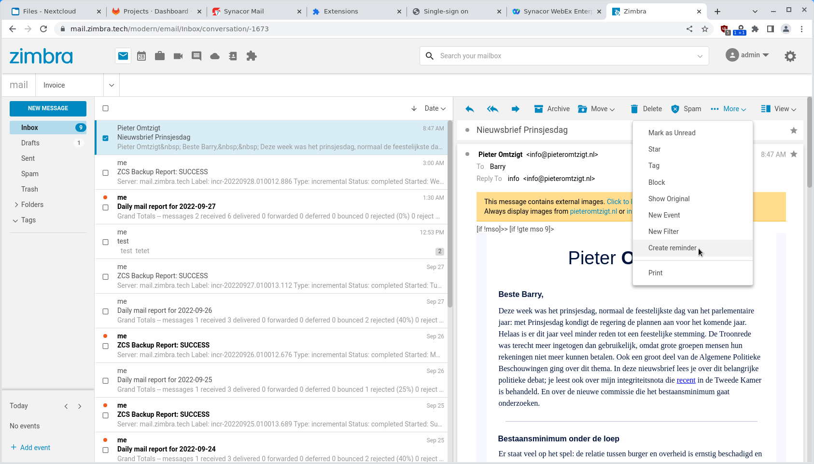

# Email Reminder Zimlet

Create a calendar reminder based on an email message.

## Installing

Download the Zip file from the Github releases page and install as zimbra user:

```
zmzimletctl deploy zimbra-zimlet-email-reminder
```

## Screenshots

> 
> 
> 
